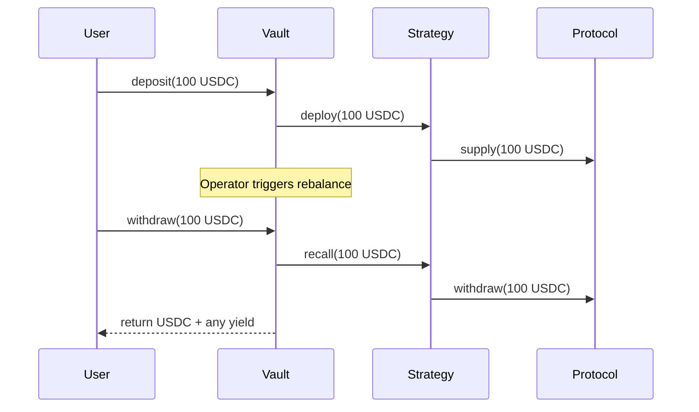

# PM-Ready Technical Context

## Purpose

This document packages the complete technical thinking for MantleYield, designed for PM, developers, and hackathon judges. It synthesizes the Solution Architect and Principal Engineer perspectives into a unified narrative.

---

## Executive Summary

### What is MantleYield?

**MantleYield is a Composable Yield Router** — infrastructure-grade DeFi primitive for Mantle Network that enables automated capital routing between real DeFi protocols.

```
┌─────────────────────────────────────────────────────────────────┐
│                     MANTLEYIELD IN ONE PICTURE                   │
├─────────────────────────────────────────────────────────────────┤
│                                                                  │
│   User ──[deposit]──▶ ERC-4626 Vault ──[deploy]──▶ Strategies   │
│     ▲                      │                           │        │
│     │                      │                           ▼        │
│     └──[withdraw]────◀─────┴─────────────────◀──── Real DeFi    │
│                                                   (Lending, etc) │
│                                                                  │
└─────────────────────────────────────────────────────────────────┘
```

### The Core Thesis

> **MantleYield proves that capital can be routed through a composable vault system to real DeFi protocols on Mantle.**

This is infrastructure, not a yield farming product. The MVP demonstrates the routing mechanism works, not that it achieves optimal yields.

---

## What to Build

### Must-Have (MVP Scope)

| Component | Description | Status |
|-----------|-------------|--------|
| **ERC-4626 Vault** | Core tokenized vault for deposits/withdrawals | Required |
| **Strategy Adapter Interface** | Common interface for all strategies | Required |
| **Lending Strategy** | Real integration with lending protocol | Required |
| **Idle Strategy** | Hold assets without deployment (0% yield) | Required |
| **Manual Rebalance** | Operator-triggered capital movement | Required |
| **Minimal Frontend** | Connect, deposit, withdraw, status | Required |

### Architecture Summary

```
┌─────────────────────────────────────────────────────────────────┐
│                      TECHNICAL ARCHITECTURE                      │
├─────────────────────────────────────────────────────────────────┤
│                                                                  │
│  SMART CONTRACTS (Solidity)                                      │
│  ┌─────────────────────────────────────────────────────────┐   │
│  │  MantleYieldVault (ERC-4626)                             │   │
│  │  ├── deposit() / withdraw()                              │   │
│  │  ├── rebalance() [Operator only]                         │   │
│  │  └── pause() / unpause()                                 │   │
│  │                                                          │   │
│  │  IStrategyAdapter (Interface)                            │   │
│  │  ├── deposit() / withdraw()                              │   │
│  │  └── totalAssets()                                       │   │
│  │                                                          │   │
│  │  LendingAdapter ────────▶ Real Lending Protocol          │   │
│  │  IdleStrategy ──────────▶ Hold tokens (0% yield)         │   │
│  └─────────────────────────────────────────────────────────┘   │
│                                                                  │
│  FRONTEND (React)                                                │
│  ┌─────────────────────────────────────────────────────────┐   │
│  │  Wallet Connect │ Deposit │ Withdraw │ Balance Display   │   │
│  └─────────────────────────────────────────────────────────┘   │
│                                                                  │
└─────────────────────────────────────────────────────────────────┘
```

---

## What NOT to Build

> [!IMPORTANT]
> These items are explicitly out of scope. Do not add to the task list.

### Hard No (Prohibited)

| Item | Reason |
|------|--------|
| ❌ Mock yield | Destroys credibility |
| ❌ Simulated APY | Fake data not acceptable |
| ❌ Fake protocol calls | Proves nothing |
| ❌ Hardcoded balances | Must read real values |

### Soft No (Out of Scope for MVP)

| Item | Why Not Now | Time to Build |
|------|-------------|---------------|
| ❌ DAO governance | Complexity overkill | 2-4 weeks |
| ❌ Token incentives | Not required for demo | 2-3 weeks |
| ❌ Automated keepers | Manual trigger sufficient | 1-2 weeks |
| ❌ Multiple vaults | One vault proves concept | 1 week |
| ❌ Fancy charts | Functional > Beautiful | 1 week |
| ❌ Historical data | Current state sufficient | 1-2 weeks |

---

## Guardrails for Developers

### Code Rules

| Rule | Enforcement |
|------|-------------|
| **Real tokens only** | All transfers use actual ERC-20 |
| **Real balances** | Always read from `token.balanceOf()` |
| **Real protocol calls** | Strategy must call external protocol |
| **No hardcoded yields** | No fake APY or simulated returns |
| **Withdraw never blocked** | Even when paused |

### Allowed Simplifications

| Simplification | Why It's OK |
|----------------|-------------|
| ✅ Idle strategy (0% yield) | Real behavior, just no yield |
| ✅ Single protocol | Proves integration works |
| ✅ Manual rebalance | Same mechanism as automated |
| ✅ Testnet tokens | Same code pattern |
| ✅ Minimal UI | Functional is sufficient |

### Decision Checklist

Before implementing any feature, ask:

```
□ Does it involve real token transfers?
□ Does it read real balances?
□ Does it interact with real protocols (if claimed)?
□ Is the result verifiable on block explorer?

If ANY is "No" → Probably a mock → REJECT
```

---

## Core Flows Summary

### Happy Path



### Key Invariants

| Invariant | Description |
|-----------|-------------|
| **Asset Conservation** | Total assets = idle + Σ(strategy balances) |
| **Share Redemption** | Shares always redeemable for proportional assets |
| **Withdrawal Guarantee** | Users can ALWAYS exit |
| **Rebalance Conservation** | Rebalancing doesn't change total assets |

---

## Narrative for Judges

### The Problem We Solve

Mantle Network has a fragmented liquidity problem:
- Users must manually track yields across protocols
- Capital sits idle in suboptimal positions
- No infrastructure layer for routing capital

### Our Solution

MantleYield creates a **capital efficiency layer** that:
1. Accepts deposits into an ERC-4626 vault
2. Routes capital to real DeFi protocols via modular strategies
3. Allows rebalancing between strategies
4. Maintains full composability (vault shares usable elsewhere)

### Why This Matters

| Point | Evidence |
|-------|----------|
| **Real integration** | Connects to actual lending protocols on Mantle |
| **Composable** | Standard ERC-4626, works with other DeFi |
| **Extensible** | Strategy adapter pattern allows new protocols |
| **Production-minded** | Pause mechanism, allocation caps, guardrails |

### What We're NOT Claiming

We are **NOT claiming**:
- Best yields on Mantle
- APY optimization algorithms
- Production-ready security (needs audit)
- Feature-complete product

We **ARE demonstrating**:
- Real capital routing works ✅
- Composable vault architecture ✅
- Modular strategy integration ✅
- Production-grade thinking (failure modes, guardrails) ✅

---

## Technical Stack

| Layer | Technology | Notes |
|-------|------------|-------|
| Smart Contracts | Solidity 0.8.20+ | OpenZeppelin base |
| Framework | Foundry | Testing, deployment |
| Frontend | React + ethers.js | Minimal UI |
| Network | Mantle Sepolia | Testnet deployment |
| Protocols | Lendle (or available) | Real integration |

---

## Success Criteria

### For Demo

| Criterion | How to Verify |
|-----------|---------------|
| User deposits USDC | Transaction on explorer |
| User receives vault shares | Balance query |
| Capital deployed to protocol | Strategy balance check |
| Rebalance moves real tokens | Transaction trace |
| User withdraws 100% | Exit successfully |
| No mocked components | Code review |

### For Judges

| What Judges Should See | Evidence |
|------------------------|----------|
| Real protocol integration | On-chain calls to lending |
| Real capital movement | Token transfers in txs |
| Composable architecture | Standard ERC-4626 |
| Production thinking | Documented guardrails |
| Clear scope boundaries | Explicit non-goals |

---

## Quick Reference

### Contract Addresses (Deploy fills these)

| Contract | Address | Network |
|----------|---------|---------|
| MantleYieldVault | TBD | Mantle Sepolia |
| LendingAdapter | TBD | Mantle Sepolia |
| IdleStrategy | TBD | Mantle Sepolia |

### Key Functions

```solidity
// User functions
vault.deposit(assets, receiver) → shares
vault.withdraw(assets, receiver, owner) → shares
vault.redeem(shares, receiver, owner) → assets

// Operator functions
vault.rebalance(fromStrategy, toStrategy, amount)
vault.pause() / vault.unpause()

// View functions
vault.totalAssets() → uint256
vault.balanceOf(user) → shares
strategy.totalAssets() → uint256
```

---

## Document Map

| Document | Location | Purpose |
|----------|----------|---------|
| SYSTEM_OVERVIEW | solution-architect/ | Problem, actors, flows |
| SOLUTION_ARCHITECTURE | solution-architect/ | Components, integrations |
| CORE_FLOW | solution-architect/ | Behavioral specs |
| NON_GOAL | solution-architect/ | Explicit exclusions |
| CORE_TECHNICAL_THESIS | principal-engineer/ | Invariants, anti-mock |
| ONCHAIN_BOUNDARY | principal-engineer/ | On-chain vs off-chain |
| ARCHITECTURE_DECISION | principal-engineer/ | Key ADRs |
| FAILURE_MODES | principal-engineer/ | Guardrails, trade-offs |
| ANTI_MOCK_RULES | principal-engineer/ | Prohibited patterns |
| **PM_READY_TECH_CONTEXT** | **all/** | **This document** |

---

## Final Message

MantleYield is **infrastructure for real capital routing**. Every line of code serves this purpose. We prioritize real functionality over feature count, and correctness over complexity.

> **The MVP proves one thing: real capital can be routed through a composable vault system on Mantle. Everything else is secondary.**
