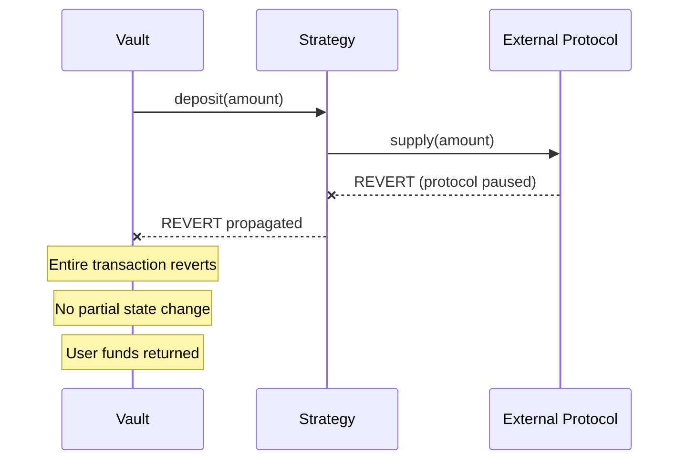
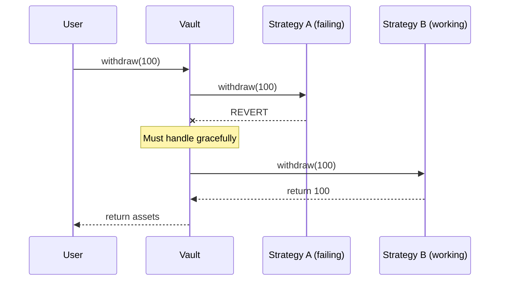

# Failure Modes and Guardrails

## Purpose

This document demonstrates production-grade thinking by cataloging failure scenarios, defining guardrails, and documenting explicit trade-offs.

---

## Failure Scenario Matrix

| ID | Scenario | Severity | Likelihood | Guardrail |
|----|----------|----------|------------|-----------|
| F-01 | Strategy reverts on deposit | Medium | Medium | Atomic transaction |
| F-02 | Strategy reverts on withdraw | Critical | Low | Fallback strategies |
| F-03 | Operator key compromised | High | Low | Timelock, multi-sig (future) |
| F-04 | Underlying protocol hacked | Critical | Low | Allocation caps |
| F-05 | Rebalance exceeds cap | Low | Medium | On-chain cap check |
| F-06 | Oracle manipulation | Medium | N/A | No oracles in MVP |
| F-07 | Reentrancy attack | Critical | Medium | ReentrancyGuard |
| F-08 | Share inflation attack | High | Low | Virtual shares |
| F-09 | Operator inactive | Low | High | System still functional |
| F-10 | Contract pause | Medium | Low | Withdraw never paused |

---

## Detailed Failure Scenarios

### F-01: Strategy Deposit Reverts



**Impact:** Medium - Deposit fails atomically, user retries later

**Guardrail:** Transaction atomicity (Solidity default)

**Recovery:** User retries deposit when protocol available

---

### F-02: Strategy Withdrawal Reverts (CRITICAL)



**Impact:** Critical - User cannot exit

**Guardrails:**
1. Multiple strategies provide redundancy
2. Idle strategy always holds some liquidity
3. Proportional withdrawal from available strategies

```solidity
function _withdrawFromStrategies(uint256 amount) internal returns (uint256) {
    uint256 withdrawn = 0;
    
    // Try each strategy in order
    for (uint i = 0; i < strategies.length && withdrawn < amount; i++) {
        uint256 available = strategies[i].totalAssets();
        uint256 toWithdraw = min(amount - withdrawn, available);
        
        try strategies[i].withdraw(toWithdraw) returns (uint256 actual) {
            withdrawn += actual;
        } catch {
            // Strategy failed, try next
            emit StrategyWithdrawFailed(address(strategies[i]));
            continue;
        }
    }
    
    return withdrawn;
}
```

---

### F-03: Operator Key Compromised

**Impact:** High - Attacker can rebalance capital

**Attack vectors with compromised operator:**
- Rebalance to malicious strategy
- Pause deposits indefinitely
- Drain funds via strategy manipulation

**Guardrails (MVP):**
| Guardrail | Status | Notes |
|-----------|--------|-------|
| Operator cannot withdraw user funds | ✅ Implemented | No direct withdrawal function |
| Operator can only call registered strategies | ✅ Implemented | Strategy whitelist |
| Allocation caps limit exposure | ✅ Implemented | Per-strategy limits |

**Future guardrails:**
- Timelock on rebalance (24h delay)
- Multi-sig operator key
- Governance override capability

---

### F-04: Underlying Protocol Hacked

**Impact:** Critical - Funds in that protocol lost

```
┌─────────────────────────────────────────────────────────────────┐
│                   PROTOCOL FAILURE SCENARIO                      │
├─────────────────────────────────────────────────────────────────┤
│                                                                  │
│  Vault Total: 1000 USDC                                          │
│  ├── Strategy A (Lending): 700 USDC ← PROTOCOL HACKED           │
│  └── Strategy B (Idle): 300 USDC    ← SAFE                      │
│                                                                  │
│  User Exposure: 70% loss potential                               │
│                                                                  │
└─────────────────────────────────────────────────────────────────┘
```

**Guardrails:**

```solidity
// Allocation cap per strategy
mapping(address => uint256) public strategyCaps;

function rebalance(address from, address to, uint256 amount) external {
    require(
        IStrategyAdapter(to).totalAssets() + amount <= strategyCaps[to],
        "Exceeds strategy cap"
    );
    // ...
}
```

**Trade-off:** Caps limit yield potential but also limit loss exposure.

---

### F-05: Rebalance Exceeds Cap

**Impact:** Low - Transaction reverts

**Guardrail:** On-chain cap validation

```solidity
function rebalance(address from, address to, uint256 amount) external {
    // Check allocation cap BEFORE executing
    uint256 newAllocation = IStrategyAdapter(to).totalAssets() + amount;
    require(newAllocation <= strategyCaps[to], "Exceeds cap");
    
    // Execute rebalance
    IStrategyAdapter(from).withdraw(amount);
    IStrategyAdapter(to).deposit(amount);
}
```

---

### F-07: Reentrancy Attack

**Impact:** Critical - Drain vault funds

**Attack pattern:**
```solidity
// Malicious token/strategy callback
function onReceive() external {
    vault.withdraw(shares);  // Re-enter before state update
}
```

**Guardrail:** ReentrancyGuard from OpenZeppelin

```solidity
import {ReentrancyGuard} from "@openzeppelin/contracts/utils/ReentrancyGuard.sol";

contract MantleYieldVault is ERC4626, ReentrancyGuard {
    function withdraw(...) external nonReentrant returns (...) {
        // Safe from reentrancy
    }
    
    function deposit(...) external nonReentrant returns (...) {
        // Safe from reentrancy
    }
}
```

---

### F-08: Share Inflation Attack (First Depositor)

**Impact:** High - Early depositors lose funds

**Attack pattern:**
1. Attacker deposits 1 wei
2. Attacker donates large amount directly
3. Victim deposits → receives 0 shares due to rounding

**Guardrail:** Virtual shares/assets

```solidity
function _convertToShares(uint256 assets, Math.Rounding rounding) internal view returns (uint256) {
    return assets.mulDiv(
        totalSupply() + 10 ** _decimalsOffset(),  // Virtual shares
        totalAssets() + 1,  // Virtual assets
        rounding
    );
}

function _decimalsOffset() internal pure returns (uint8) {
    return 3;  // 1000 virtual shares
}
```

---

## Guardrail Summary

### Emergency Controls

| Control | Trigger | Effect |
|---------|---------|--------|
| **Pause** | Operator call | Block deposits, rebalance |
| **Strategy Removal** | Owner call | Remove strategy from whitelist |
| **Allocation Cap** | Per-strategy | Limit concentration |

### Escape Hatches

```solidity
// User can ALWAYS withdraw
function withdraw(...) external returns (...) {
    // No whenNotPaused modifier
    // This function NEVER reverts due to pause
}

// Emergency strategy removal
function emergencyRemoveStrategy(address strategy) external onlyOwner {
    // Withdraw all from strategy first
    uint256 balance = IStrategyAdapter(strategy).totalAssets();
    IStrategyAdapter(strategy).withdraw(balance);
    
    // Remove from whitelist
    isStrategy[strategy] = false;
    emit StrategyRemoved(strategy);
}
```

---

## Explicit Trade-offs

### Trade-off 1: Caps vs Yield

| Factor | With Caps | Without Caps |
|--------|-----------|--------------|
| Max yield | Limited by diversification | Maximize single strategy |
| Max loss | Limited by cap | 100% exposure |
| **Decision** | **Use caps** | |

**Rationale:** Loss limitation more important than yield maximization for MVP.

---

### Trade-off 2: Immutable vs Upgradeable

| Factor | Immutable | Upgradeable |
|--------|-----------|-------------|
| Bug fixes | Requires migration | In-place upgrade |
| Trust | Higher (code is law) | Lower (admin can change) |
| Complexity | Lower | Higher |
| **Decision** | **Immutable** | |

**Rationale:** Reduced attack surface more important for hackathon scope.

---

### Trade-off 3: Manual vs Automated Rebalance

| Factor | Manual | Automated |
|--------|--------|-----------|
| Responsiveness | Slower | Faster |
| Infrastructure | None needed | Keeper required |
| Control | Operator decides | Rules decide |
| **Decision** | **Manual** | |

**Rationale:** Simplicity and control for MVP outweigh automation benefits.

---

### Trade-off 4: Single Asset vs Multi-Asset

| Factor | Single | Multi |
|--------|--------|-------|
| Complexity | Low | High |
| User flexibility | Limited | High |
| Oracle dependency | None | Required |
| **Decision** | **Single** | |

**Rationale:** Avoid oracle complexity and focus on core routing proof.

---

## Monitoring Checklist (Post-MVP)

For production, add monitoring for:

- [ ] Strategy health checks
- [ ] Balance anomaly detection
- [ ] Rebalance frequency tracking
- [ ] Gas usage per operation
- [ ] Event log aggregation
- [ ] Alert thresholds for caps
