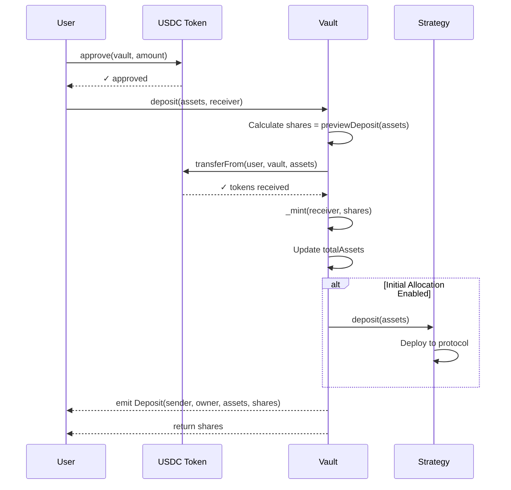
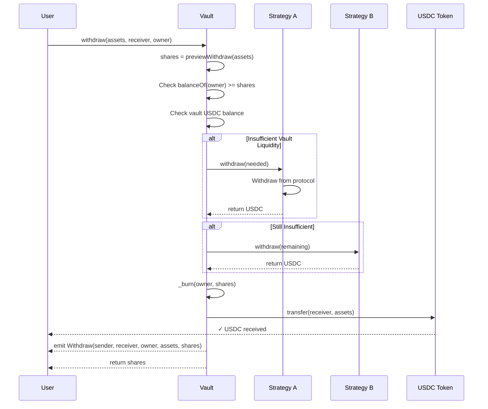
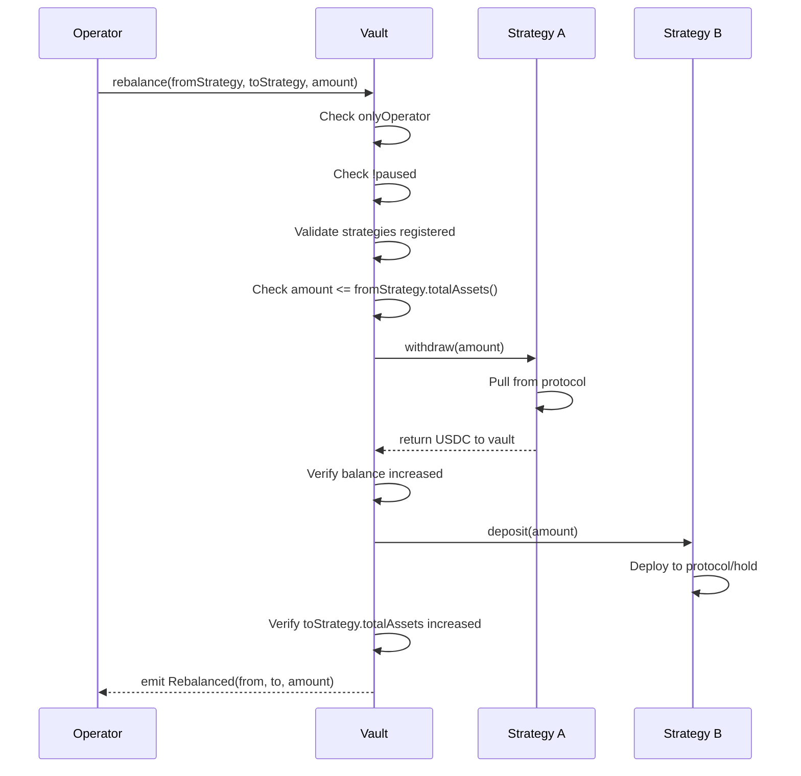
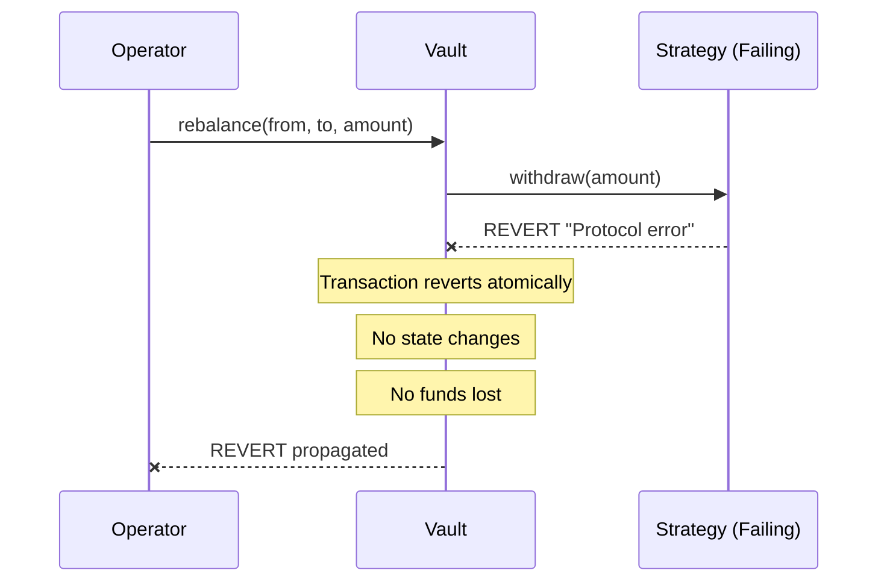
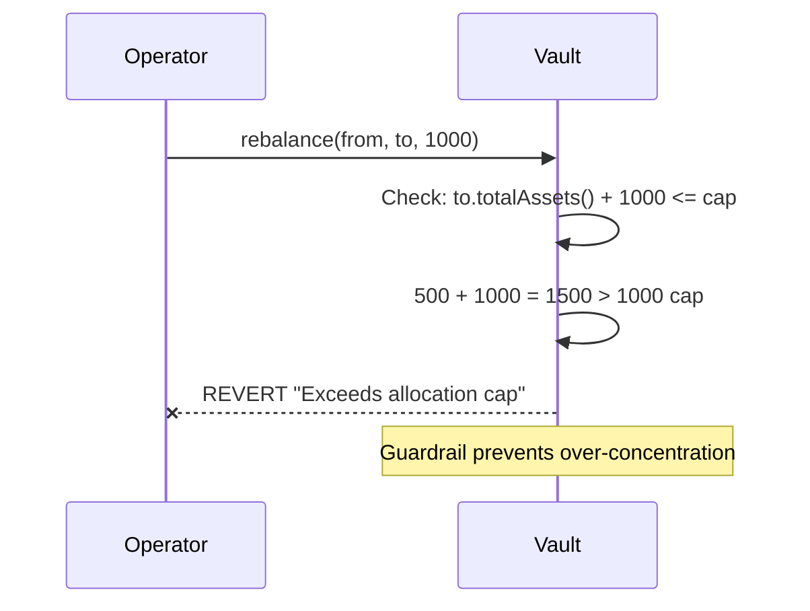
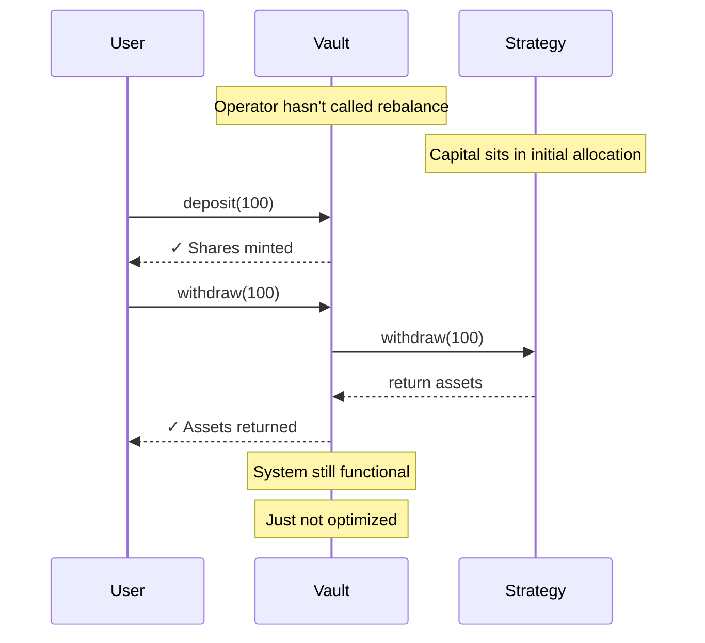
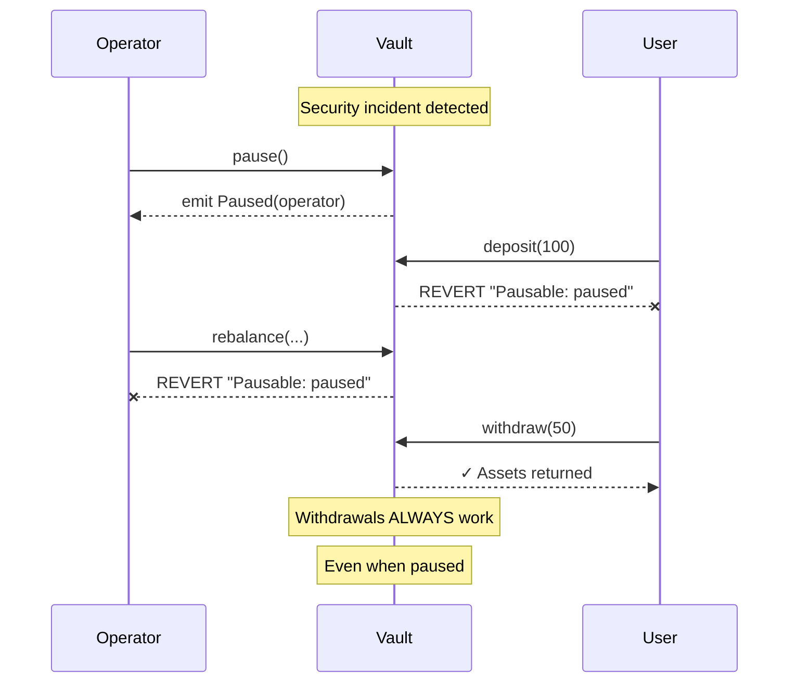
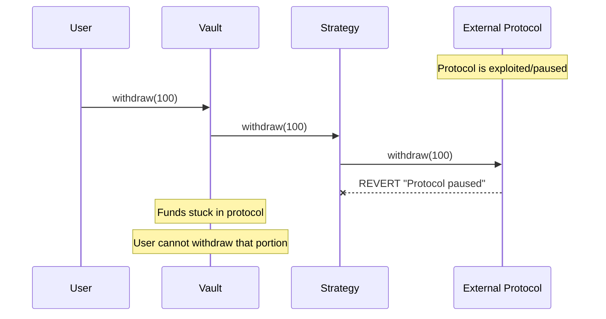

# Core Flows

## Purpose

This document describes MantleYield system behavior through detailed flow specifications. Each flow includes happy path, edge cases, and failure handling.

---

## Flow 1: Deposit

### Happy Path



### State Changes

| State Variable | Before | After |
|----------------|--------|-------|
| `balanceOf(user)` | 0 | shares |
| `totalSupply` | X | X + shares |
| `totalAssets` | Y | Y + assets |
| USDC in vault/strategy | Z | Z + assets |

### Preconditions

| Check | Condition | Revert Message |
|-------|-----------|----------------|
| Allowance | `token.allowance(user, vault) >= assets` | "ERC20: insufficient allowance" |
| Balance | `token.balanceOf(user) >= assets` | "ERC20: transfer amount exceeds balance" |
| Not Paused | `!paused` | "Pausable: paused" |
| Amount > 0 | `assets > 0` | "Cannot deposit 0" |

### Postconditions

- ✅ User holds vault shares proportional to deposit
- ✅ Vault (or strategy) holds deposited assets
- ✅ `Deposit` event emitted

---

## Flow 2: Withdraw

### Happy Path



### Withdrawal Priority Logic

```
1. Check vault idle balance
2. If insufficient → withdraw from Strategy A
3. If still insufficient → withdraw from Strategy B
4. Continue until sufficient liquidity
5. Transfer to user
```

### State Changes

| State Variable | Before | After |
|----------------|--------|-------|
| `balanceOf(user)` | shares | 0 (if full) |
| `totalSupply` | X | X - shares |
| `totalAssets` | Y | Y - assets |
| User USDC balance | Z | Z + assets |

### Preconditions

| Check | Condition | Revert Message |
|-------|-----------|----------------|
| Shares Available | `balanceOf(owner) >= shares` | "ERC4626: withdraw more than max" |
| Not Paused | `!paused` | "Pausable: paused" |
| Sufficient Liquidity | Strategies can fulfill | "Insufficient liquidity" |

### Postconditions

- ✅ User receives requested assets
- ✅ Vault shares burned
- ✅ `Withdraw` event emitted
- ✅ No loss of user funds

> [!IMPORTANT]
> **Withdraw MUST always work.** If strategies cannot provide liquidity, this is a critical bug.

---

## Flow 3: Rebalance

### Happy Path



### Rebalance Types

| Type | From | To | Use Case |
|------|------|-----|----------|
| **Deploy** | Idle | Protocol | Put capital to work |
| **Recall** | Protocol | Idle | Reduce exposure |
| **Shift** | Protocol A | Protocol B | Change allocation |

### State Changes

| State Variable | Before | After |
|----------------|--------|-------|
| `strategyA.totalAssets()` | X | X - amount |
| `strategyB.totalAssets()` | Y | Y + amount |
| `vault.totalAssets()` | Z | Z (unchanged) |

> [!NOTE]
> Total assets MUST remain constant during rebalance. Any change indicates a bug or yield/loss event.

### Preconditions

| Check | Condition | Revert Message |
|-------|-----------|----------------|
| Caller | `msg.sender == operator` | "Not operator" |
| Not Paused | `!paused` | "Pausable: paused" |
| From Registered | `isStrategy[from]` | "Invalid from strategy" |
| To Registered | `isStrategy[to]` | "Invalid to strategy" |
| Sufficient Balance | `from.totalAssets() >= amount` | "Insufficient strategy balance" |
| Allocation Cap | `to.totalAssets() + amount <= cap` | "Exceeds allocation cap" |

### Postconditions

- ✅ Capital moved between strategies
- ✅ Total vault assets unchanged
- ✅ `Rebalanced` event emitted
- ✅ Verifiable on block explorer

---

## Flow 4: Failure Scenarios

### Failure 4.1: Strategy Reverts



**Handling:**
- Entire transaction reverts
- No partial state changes
- User funds remain safe
- Operator must retry or investigate

---

### Failure 4.2: Rebalance Exceeds Allocation Cap



**Handling:**
- Transaction reverts before execution
- Operator must reduce amount or raise cap
- Prevents concentration risk

---

### Failure 4.3: Operator Inactive



**Handling:**
- System remains fully functional
- Users can deposit/withdraw normally
- Only yield optimization is affected
- No emergency action needed

---

### Failure 4.4: Emergency Pause



**Pause Behavior:**

| Function | When Paused |
|----------|-------------|
| `deposit()` | ❌ Blocked |
| `rebalance()` | ❌ Blocked |
| `withdraw()` | ✅ **Always works** |
| `redeem()` | ✅ **Always works** |

> [!CAUTION]
> **Withdrawals must NEVER be paused.** Users must always be able to exit with their funds.

---

### Failure 4.5: Underlying Protocol Failure



**Handling:**
- This is external risk, not MantleYield bug
- Partial withdrawals from other strategies may work
- Emergency procedures needed
- Trading of vault shares may be alternative exit

**Mitigation:**
- Cap allocation per strategy
- Monitor protocol health
- Maintain idle liquidity buffer

---

## Flow Summary Table

| Flow | Actor | Happy Path Result | Failure Handling |
|------|-------|-------------------|------------------|
| **Deposit** | User | Shares minted, assets deployed | Atomic revert |
| **Withdraw** | User | Assets returned, shares burned | Always works (critical) |
| **Rebalance** | Operator | Capital moved between strategies | Atomic revert |
| **Pause** | Operator | Deposits/rebalance blocked | Withdraw still works |

---

## Invariants

These conditions must **ALWAYS** hold:

```solidity
// Sum of all strategy balances equals totalAssets
assert(totalAssets() == sum(strategies[i].totalAssets()) + idleBalance());

// Shares can always be redeemed for proportional assets
assert(previewRedeem(shares) * totalSupply <= shares * totalAssets);

// Withdraw never fails when user has shares
// (unless external protocol failure)
assert(withdraw(balanceOf(user)) succeeds);

// Rebalance does not change totalAssets
uint256 before = totalAssets();
rebalance(from, to, amount);
assert(totalAssets() == before);
```
