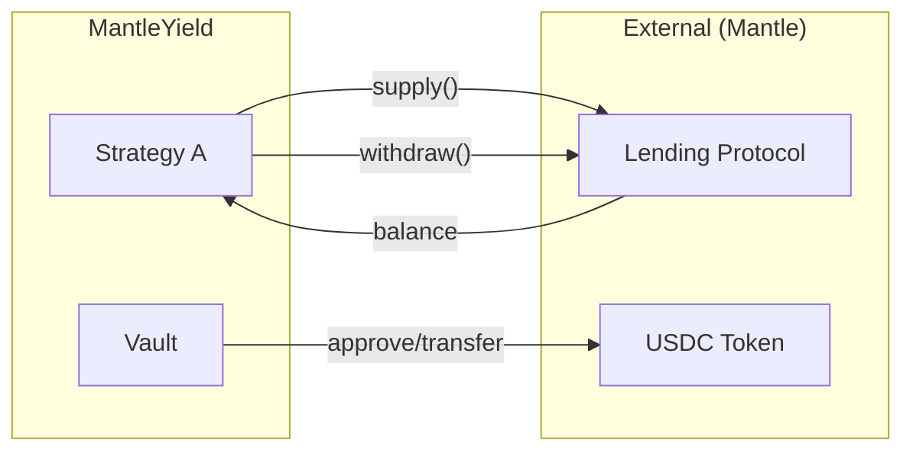

# Solution Architecture

## Purpose

This document defines the concrete solution architecture for MantleYield, specifying logical components, integration points, data flows, and deployment topology.

---

## Logical Components

### Component Hierarchy

```
┌─────────────────────────────────────────────────────────────────────────────┐
│                           MANTLEYIELD ARCHITECTURE                           │
├─────────────────────────────────────────────────────────────────────────────┤
│                                                                              │
│  ┌─────────────────────────────────────────────────────────────────────┐   │
│  │                         FRONTEND LAYER                               │   │
│  │  ┌──────────────┐  ┌──────────────┐  ┌──────────────┐              │   │
│  │  │  Deposit UI  │  │ Withdraw UI  │  │  Status UI   │              │   │
│  │  └──────────────┘  └──────────────┘  └──────────────┘              │   │
│  └─────────────────────────────────────────────────────────────────────┘   │
│                                    │                                         │
│                              [ethers/wagmi]                                  │
│                                    ▼                                         │
│  ┌─────────────────────────────────────────────────────────────────────┐   │
│  │                         SMART CONTRACT LAYER                         │   │
│  │                                                                      │   │
│  │  ┌────────────────────────────────────────────────────────────┐    │   │
│  │  │                    MantleYieldVault                         │    │   │
│  │  │                     (ERC-4626)                              │    │   │
│  │  │  ┌─────────┐ ┌─────────┐ ┌─────────┐ ┌─────────────────┐  │    │   │
│  │  │  │deposit()│ │withdraw│ │totalAsset│ │  rebalance()    │  │    │   │
│  │  │  └─────────┘ └─────────┘ └─────────┘ └─────────────────┘  │    │   │
│  │  └────────────────────────────────────────────────────────────┘    │   │
│  │                              │                                      │   │
│  │                    [IStrategyAdapter]                               │   │
│  │                              ▼                                      │   │
│  │  ┌─────────────────────┐         ┌─────────────────────┐          │   │
│  │  │   StrategyAdapter A │         │   StrategyAdapter B │          │   │
│  │  │   (Lending Protocol)│         │   (Idle / Protocol) │          │   │
│  │  └─────────────────────┘         └─────────────────────┘          │   │
│  │            │                               │                        │   │
│  └────────────┼───────────────────────────────┼────────────────────────┘   │
│               │                               │                             │
│               ▼                               ▼                             │
│  ┌─────────────────────┐         ┌─────────────────────┐                  │
│  │  External Protocol  │         │  Vault Internal     │                  │
│  │  (Lendle/AAVE-fork) │         │  (Idle holds USDC)  │                  │
│  └─────────────────────┘         └─────────────────────┘                  │
│                                                                              │
└─────────────────────────────────────────────────────────────────────────────┘
```

### Component Specifications

#### 1. MantleYieldVault (Core)

| Attribute | Value |
|-----------|-------|
| **Standard** | ERC-4626 Tokenized Vault |
| **Base Asset** | USDC (or testnet equivalent) |
| **Share Token** | myUSDC (vault shares) |
| **Access Control** | Owner (deploy), Operator (rebalance) |

**Responsibilities:**
- Accept ERC-20 deposits from users
- Mint proportional vault shares
- Track `totalAssets()` across all strategies
- Coordinate withdrawals from strategies
- Execute rebalance between strategies

**Does NOT:**
- Calculate or simulate yield
- Store APY data
- Make autonomous decisions

---

#### 2. IStrategyAdapter (Interface)

```solidity
interface IStrategyAdapter {
    /// @notice Deposit assets into the strategy
    function deposit(uint256 amount) external;
    
    /// @notice Withdraw assets from the strategy
    function withdraw(uint256 amount) external returns (uint256 actualAmount);
    
    /// @notice Get total assets managed by this strategy
    function totalAssets() external view returns (uint256);
    
    /// @notice Get the underlying asset address
    function asset() external view returns (address);
}
```

---

#### 3. LendingStrategyAdapter (Strategy A)

| Attribute | Value |
|-----------|-------|
| **Type** | Real Protocol Integration |
| **Target** | Lendle (or available lending protocol on Mantle) |
| **Operations** | supply(), withdraw() on underlying protocol |

**Data Read:**
- Real balance from lending protocol
- Actual receipt tokens held

---

#### 4. IdleStrategy (Strategy B)

| Attribute | Value |
|-----------|-------|
| **Type** | Baseline Strategy |
| **Yield** | 0% (no yield generation) |
| **Purpose** | Hold assets, prove capital routing |

> [!NOTE]
> IdleStrategy is **NOT** a mock. It is a legitimate strategy that holds assets without deploying them. This proves the routing mechanism works.

---

## Integration Points

### External Integrations



| Integration | Type | Protocol |
|-------------|------|----------|
| **ERC-20 Token** | Asset | USDC on Mantle testnet |
| **Lending Protocol** | Yield Source | Lendle / AAVE-fork |
| **Mantle RPC** | Infrastructure | Official Mantle RPC |

### Internal Integrations

| Component A | Component B | Interface |
|-------------|-------------|-----------|
| Vault | Strategy A | IStrategyAdapter |
| Vault | Strategy B | IStrategyAdapter |
| Frontend | Vault | ERC-4626 ABI |
| Frontend | RPC | JSON-RPC |

---

## Data Flows

### Asset Flow (Tokens)

```
┌──────────────────────────────────────────────────────────────────┐
│                        ASSET FLOW                                 │
├──────────────────────────────────────────────────────────────────┤
│                                                                   │
│  User Wallet ──[USDC]──▶ Vault ──[USDC]──▶ Strategy A            │
│       ▲                    │                    │                 │
│       │                    │                    ▼                 │
│       │                    │           Lending Protocol          │
│       │                    │                    │                 │
│       │                    ▼                    │                 │
│       │              Strategy B                 │                 │
│       │              (Idle USDC)                │                 │
│       │                    │                    │                 │
│       └────[USDC]──────────┴────────────────────┘                │
│                     (withdrawal)                                  │
│                                                                   │
└──────────────────────────────────────────────────────────────────┘
```

### Signal Flow (Events)

| Event | Source | Data | Consumer |
|-------|--------|------|----------|
| `Deposit` | Vault | sender, assets, shares | Frontend |
| `Withdraw` | Vault | sender, assets, shares | Frontend |
| `Rebalanced` | Vault | fromStrategy, toStrategy, amount | Frontend |
| `StrategyAdded` | Vault | strategyAddress | Operator |

### Event Definitions

```solidity
event Deposit(address indexed sender, address indexed owner, uint256 assets, uint256 shares);
event Withdraw(address indexed sender, address indexed receiver, address indexed owner, uint256 assets, uint256 shares);
event Rebalanced(address indexed fromStrategy, address indexed toStrategy, uint256 amount);
event StrategyAdded(address indexed strategy);
event StrategyRemoved(address indexed strategy);
event Paused(address account);
event Unpaused(address account);
```

---

## Deployment Topology

### Testnet Deployment

```
┌─────────────────────────────────────────────────────────────────┐
│                    MANTLE TESTNET DEPLOYMENT                     │
├─────────────────────────────────────────────────────────────────┤
│                                                                  │
│  Contracts:                                                      │
│  ┌───────────────────────────────────────────────────────────┐  │
│  │  0x... MantleYieldVault                                   │  │
│  │  0x... LendingStrategyAdapter                             │  │
│  │  0x... IdleStrategy                                       │  │
│  └───────────────────────────────────────────────────────────┘  │
│                                                                  │
│  External Contracts (Pre-existing):                              │
│  ┌───────────────────────────────────────────────────────────┐  │
│  │  0x... USDC (Testnet)                                     │  │
│  │  0x... Lending Protocol Pool                              │  │
│  └───────────────────────────────────────────────────────────┘  │
│                                                                  │
│  Network:                                                        │
│  ┌───────────────────────────────────────────────────────────┐  │
│  │  Chain ID: 5003 (Mantle Sepolia)                          │  │
│  │  RPC: https://rpc.sepolia.mantle.xyz                      │  │
│  │  Explorer: https://sepolia.mantlescan.xyz                 │  │
│  └───────────────────────────────────────────────────────────┘  │
│                                                                  │
└─────────────────────────────────────────────────────────────────┘
```

### Frontend Deployment

| Component | Platform | URL |
|-----------|----------|-----|
| **React App** | Vercel / Netlify | `mantleyield.vercel.app` |
| **Static Assets** | CDN | Built-in |

### Infrastructure Requirements

| Resource | Testnet | Notes |
|----------|---------|-------|
| **RPC** | Mantle Sepolia | Public endpoint |
| **Wallet** | MetaMask | User-provided |
| **Deploy Key** | Private | Operator EOA |
| **Test Tokens** | Faucet | USDC/MNT |

---

## Technology Stack

### Smart Contracts

| Layer | Technology |
|-------|------------|
| Language | Solidity ^0.8.20 |
| Framework | Foundry |
| Testing | Forge |
| Libraries | OpenZeppelin |

### Frontend

| Layer | Technology |
|-------|------------|
| Framework | React/Next.js |
| Web3 | ethers.js / wagmi |
| Styling | TailwindCSS |
| State | React Query |

### DevOps

| Layer | Technology |
|-------|------------|
| CI/CD | GitHub Actions |
| Deploy | Foundry script |
| Verify | Mantle Explorer |

---

## Security Boundaries

```
┌─────────────────────────────────────────────────────────────────┐
│                      TRUST BOUNDARIES                            │
├─────────────────────────────────────────────────────────────────┤
│                                                                  │
│  ┌─────────────────────────────────────────────────────────┐   │
│  │  TRUSTED ZONE (Our Code)                                 │   │
│  │  - MantleYieldVault                                      │   │
│  │  - Strategy Adapters                                     │   │
│  │  - Access Control Logic                                  │   │
│  └─────────────────────────────────────────────────────────┘   │
│                              │                                   │
│                      [Trust Boundary]                            │
│                              ▼                                   │
│  ┌─────────────────────────────────────────────────────────┐   │
│  │  EXTERNAL ZONE (Third Party)                             │   │
│  │  - Lending Protocol                                      │   │
│  │  - USDC Token Contract                                   │   │
│  │  - Mantle Network                                        │   │
│  └─────────────────────────────────────────────────────────┘   │
│                                                                  │
└─────────────────────────────────────────────────────────────────┘
```

### Access Control Matrix

| Role | Vault Functions | Strategy Functions |
|------|-----------------|-------------------|
| **User** | deposit, withdraw, redeem | ❌ |
| **Operator** | rebalance, pause | ❌ |
| **Owner** | addStrategy, removeStrategy, unpause | All |
| **Anyone** | totalAssets, balanceOf, previewDeposit | totalAssets |
