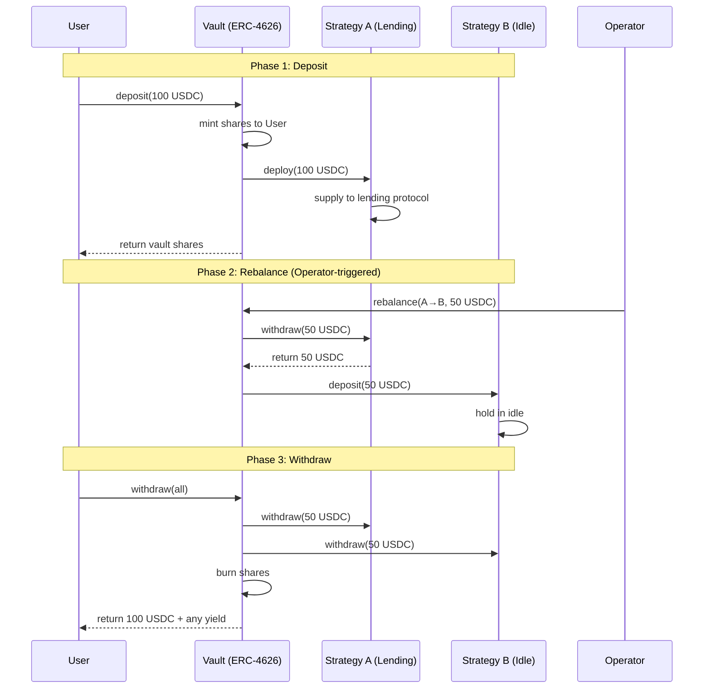

# MantleYield System Overview

## Executive Summary

**MantleYield** is a **Composable Yield Router** designed as infrastructure-grade DeFi primitive for Mantle Network. It provides automated capital routing between real DeFi protocols, enabling users to deposit once and benefit from optimized yield strategies.

> [!IMPORTANT]
> MantleYield is **NOT** a yield farming dApp. It is a **capital efficiency layer** that proves real capital routing between real protocols.

---

## Problem Statement

### The Capital Efficiency Problem on Mantle Network

Despite rapid DeFi growth on Mantle, **capital efficiency remains critically low**:

| Problem | Impact |
|---------|--------|
| **Fragmented Liquidity** | Capital scattered across lending protocols, DEX LPs, and RWA pools |
| **Manual APY Monitoring** | Users must constantly track and compare yields across protocols |
| **Suboptimal Allocation** | Capital often sits in low-yield positions, reducing ecosystem efficiency |
| **Single-Protocol Solutions** | Existing optimizers focus on one protocol only |

### Why This Matters for Mantle

Mantle's **low gas fees** and **high throughput** create a unique opportunity for frequent, cost-efficient rebalancing that other L1s cannot support economically. MantleYield leverages this advantage.

---

## System Actors

### Primary Actors

```
┌─────────────────────────────────────────────────────────────────┐
│                         MANTLEYIELD SYSTEM                       │
├─────────────────────────────────────────────────────────────────┤
│                                                                  │
│   USER                    VAULT                    STRATEGY      │
│   ┌─────┐                ┌─────┐                  ┌─────┐       │
│   │     │ ──deposit()──▶ │     │ ──deploy()────▶  │  A  │       │
│   │     │ ◀──shares───── │ ERC │                  └─────┘       │
│   │     │                │4626 │                  ┌─────┐       │
│   │     │ ──withdraw()─▶ │     │ ──withdraw()──▶  │  B  │       │
│   │     │ ◀──assets───── │     │                  └─────┘       │
│   └─────┘                └─────┘                                │
│                              ▲                                   │
│                              │                                   │
│   OPERATOR              rebalance()                              │
│   ┌─────┐                    │                                   │
│   │     │ ──────────────────┘                                   │
│   └─────┘                                                        │
│                                                                  │
└─────────────────────────────────────────────────────────────────┘
```

| Actor | Role | Permissions |
|-------|------|-------------|
| **User** | Liquidity provider | `deposit()`, `withdraw()` |
| **Vault** | Core primitive | Custody, accounting, share minting |
| **Strategy** | Protocol adapter | Deploy/withdraw capital to external DeFi |
| **Operator** | System admin | `rebalance()` trigger |

### Non-Actors (MVP)

- ❌ DAO / Governance token holders
- ❌ Keeper bots (automated)
- ❌ Oracle providers
- ❌ External integrators

---

## High-Level Flow (Happy Path)

### Complete User Journey



### Flow Summary

| Phase | Action | On-Chain Result |
|-------|--------|-----------------|
| **1. Deposit** | User deposits ERC-20 | Vault mints shares, assets deployed |
| **2. Rebalance** | Operator triggers reallocation | Real token transfers between strategies |
| **3. Withdraw** | User redeems shares | Vault withdraws from strategies, returns assets |

---

## Explicit Assumptions

### Technical Assumptions

| Assumption | Rationale |
|------------|-----------|
| **Mantle testnet is available** | Required for demo deployment |
| **At least one real lending protocol exists on Mantle** | Need real integration target |
| **ERC-20 stablecoins available on testnet** | Primary deposit asset class |
| **Gas costs negligible for demo** | Mantle's low-gas advantage |

### Trust Model Assumptions

| Component | Trust Level | Notes |
|-----------|-------------|-------|
| **Vault Contract** | Fully trusted | Holds all user funds |
| **Strategy Adapters** | Trusted | Must interact with real protocols |
| **Operator** | Semi-trusted | Can rebalance, cannot steal |
| **Underlying Protocols** | External trust | Assumed functional and secure |

### MVP Assumptions

- Single vault instance only
- Single deposit asset type (USDC or equivalent)
- Manual rebalance (no automation)
- No yield optimization algorithm
- No on-chain APY calculation

---

## Constraints

### Hard Constraints (Cannot Violate)

| Constraint | Description |
|------------|-------------|
| **No Mocking** | All protocol interactions must be real |
| **No Yield Simulation** | No fake APY or simulated returns |
| **Withdraw Always Works** | User must always be able to exit |
| **Real Capital Movement** | Rebalance must move actual tokens |

### Soft Constraints (MVP Trade-offs)

| Constraint | MVP Decision |
|------------|--------------|
| **Single Strategy Required** | At least one real protocol integration |
| **Second Strategy Optional** | Can be real protocol OR idle strategy |
| **No Automated Keeper** | Manual operator trigger acceptable |
| **Minimal Frontend** | Functional over beautiful |

### Time Constraints

| Resource | Constraint |
|----------|------------|
| **Duration** | 14-day hackathon MVP |
| **Team** | Limited developer bandwidth |
| **Testing** | Testnet only, no mainnet |

---

## What MantleYield Proves

The MVP is designed to demonstrate:

1. ✅ **Real capital routing** between DeFi protocols
2. ✅ **ERC-4626 composability** with standard interface
3. ✅ **Correct architecture** for future extensibility
4. ✅ **Modular strategy system** for plug-in integrations
5. ✅ **Production-grade thinking** with failure handling

> [!CAUTION]
> The MVP does **NOT** prove optimal yield generation. APY optimization is explicitly out of scope.

---

## Success Criteria

| Criterion | Verification Method |
|-----------|---------------------|
| User can deposit USDC | On-chain transaction |
| User receives vault shares | Balance check |
| Capital deployed to real protocol | Block explorer verification |
| Rebalance moves real tokens | Transaction trace |
| User can withdraw 100% | Exit without loss |
| No mocked components | Code review |

---

## Document Dependencies

This system overview informs:

- [SOLUTION_ARCHITECTURE.md](./SOLUTION_ARCHITECTURE.md) - Detailed component design
- [CORE_FLOW.md](./CORE_FLOW.md) - Behavioral specifications
- [NON_GOAL.md](./NON_GOAL.md) - Explicit exclusions
